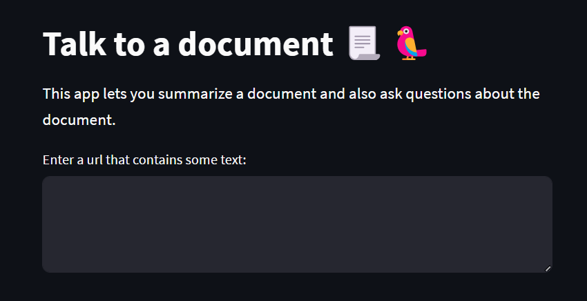
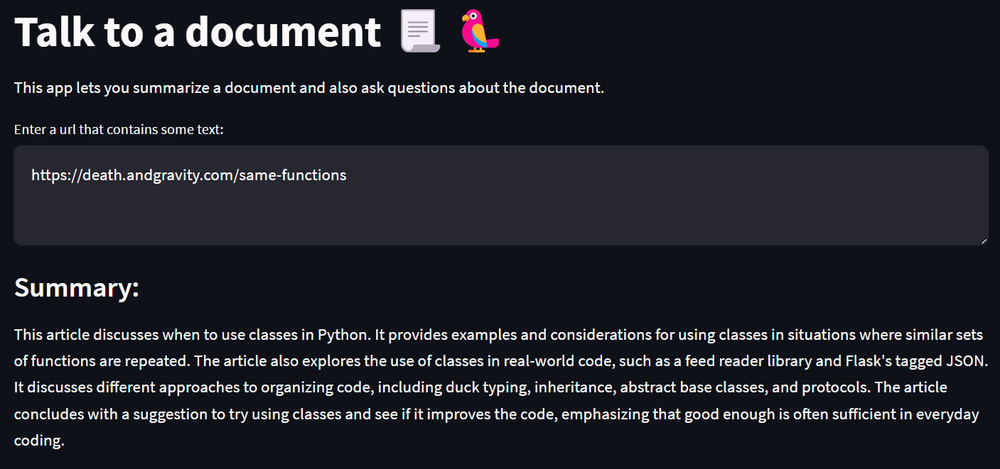
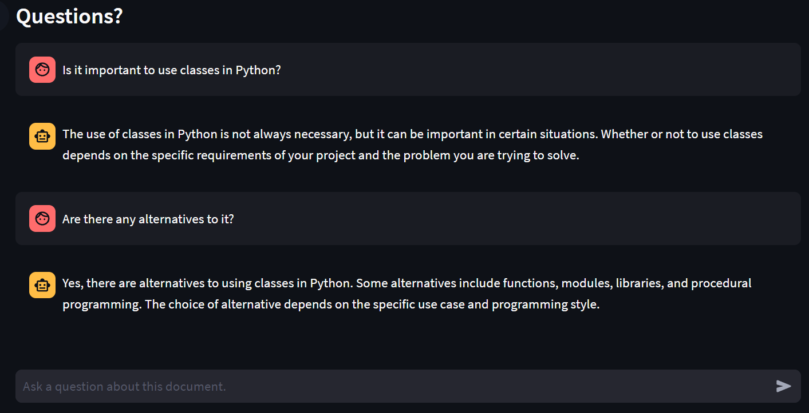
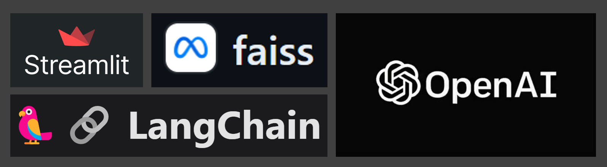

# Talk to a document 📃🦜

This repository is for an app that lets you (a) summarize a document and (b) ask questions about the document. You can point to the URL that contains some text (e.g., an article, a blog post, or an essay) and the app will summarize its content. You can then chat with an agent to ask questions about the document.

## 🚀 Instructions to Launch the App

<b>Show instructions</b>

Once you make a copy of this codebase on your computer, activate a Python virtual environment using the following command:

`python -m venv .venv --prompt doc-qa`

Once the Python virtual environment is created, activate it and install all dependencies from `requirements.txt`.

`source .venv/bin/activate`

`pip install -r requirements.txt`

Once all dependencies are installed, you can launch the app using the following command:

`streamlit run src/app.py`

In a few seconds the app will be lanuched in your browser. If that doesn't happen automatically, you can copy the URL that's printed in the output.

## 🔑Secrets

<b>Show config settings</b>

This app makes a call to the OpenAI API. You will need to get the API key from [OpenAI] and store it locally in the `.env` file.

[OpenAI]:      https://openai.com

## 🤔How to Use the App

<b>Show intructions</b>

Once the app is launched in the browser, you will see the following:

	

You can paste a URL link that contains some text, such as an article, a blog post, or an essay. Hit Ctrl + Enter once you paste the URL.

A summary of the article will displayed in a few minutes. See example below for an [article] about when to use classes in Python.
[article]:     https://death.andgravity.com/same-functions

	

Once a summary is displayed, you can start chatting with the agent and ask questions about the document. Here are some examples:

	

Note that the agent does have memory about recent questions. In the follow-up question above, I asked if there are any alternatives to it, and the agent knew what Imeant by "it" (using Python classes).

## ⚙️How It Works

<b>Show details</b>

Here's the list of tools used to develop this app:

	

[Streamlit](https://streamlit.io)
[LangChain](https://docs.langchain.com)
[FAISS](https://faiss.ai)
[OpenAI](https://openai.com/product)

The text from the document is loaded and summarized using LangChain.

Then the document is divided into multiple chunks, each of which are passed to OpenAI API to create embeddings. These embeddings are stored in a local vector database using FAISS. 

When you ask a question, the question text gets converted into an embedding vector, which is then compared with all vectors that are available in the vector database. The most appropriate chunk of text is returned and passed on to OpenAI API as context for the question.

Please note that the app uses **gpt-3.5-turbo-16k** from OpenAI. You can change this, and some other settings in `config.py`.

## 💡Potential Improvements

<b>Show details</b>

Here are some improvements that can enhance the functionality or utility of this app:

1. Allow users to upload PDF document as well. Currently, the app only accepts URL links as inputs.
2. Instead of typing their questions, allow the users to ask their question by using voice (microphone).
3. Include some error handling.

### ❤️Sources

<b>Show sources</b>

[LLM Chain Documentation: Agent with Memory](https://python.langchain.com/docs/modules/memory/agent_with_memory)

[Streamlit Tutorial: Build Conversational App](https://docs.streamlit.io/knowledge-base/tutorials/build-conversational-apps)

